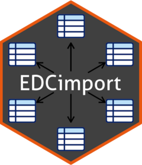

# EDCimport <a href="https://DanChaltiel.github.io/EDCimport/"></a>
<!-- badges: start -->

[](https://lifecycle.r-lib.org/articles/stages.html) 
[](https://CRAN.R-project.org/package=EDCimport) 
[](https://github.com/DanChaltiel/EDCimport) 
[](https://github.com/DanChaltiel/EDCimport/actions/workflows/check-standard.yaml)
<!--[](https://r-pkg.org/pkg/EDCimport)  --> 
<!-- badges: end -->

## Introduction 📦

The **EDCimport** package is designed to simplify the import and management of Electronic Data Capture (EDC) exports, particularly in clinical research settings. It is an opinionated framework, providing multiple streamlined tools for importing, cleaning, and checking your datasets.

> [!WARNING]
> This package is experimental and under active development. Backward compatibility is not a priority for the moment. For reproducibility, use [renv](https://rstudio.github.io/renv/articles/renv.html) to set the package version.


## Installation 🛠️

``` r
# Install last version available on CRAN
install.packages("EDCimport")

# Install development version on Github
pak::pak("DanChaltiel/EDCimport@v0.5.2.9071")
```

> [!WARNING]
> The documentation pertains to the dev version, not the one on CRAN.

## Features 🚀 

### Load the data

Use one of `read_all_sas()`, `read_all_xpt()`, `read_all_csv()`, or `read_trialmaster()`, depending on the type of files in your export directory. You can then load your datasets into the global environment with `load_database()`.

``` r
library(EDCimport)
db = read_all_sas("path/to/my/files/folder")
print(db)
load_database(db) #this also removes `db` to save some RAM
mean(dataset1$column5)
```

### Database management tools

`EDCimport` includes a set of useful tools that help with using the imported database. See [References](https://danchaltiel.github.io/EDCimport/reference/index.html) for the complete list.

#### Database summary

`edc_lookup()` returns a dataframe containing the number of rows, columns, patients, and the CRF 
name of each dataset.

#### Search the whole database

`find_keyword()` runs a global search of the database for a given keyword (or regex). 

For instance, say you are looking for the "date of ECG" but don't know where it is, you can run `find_keyword("date")` or `find_keyword("ecg")`.

It won't look into the actual data, though, as this would take too much computing power.

#### Get the last news date of each subject

`lastnews_table()` finds the last date of each subject throughout the whole database and inform on
the date original dataset and column. It has arguments to avoid selecting irrelevant dates.

This is very useful to get the actual followup time when fitting survival analyses.

#### Data checking system

`edc_data_warn()` throws a warning if an inconsistency is found in a dataset. The interface allows
to perform multiple checks and get a report as a CSV file.

#### Join helpers

As the primary key is almost always the Subject ID, join helpers were added to reduce code clutter. 
Currently, only `edc_left_join()`, `edc_right_join()`, and `edc_full_join()` are supported.

#### Shiny browser

`edc_viewer()` runs a shiny application that browses the whole database. The HTML interface is quicker 
and less cluttered than it would be in RStudio. It also allows filtering by Subject ID.

#### Swimmer Plot

`edc_swimmerplot()` creates a swimmer plot of **all date variables** of the whole database. 
This is very useful to find inconsistencies and outliers, especially with the `plotly` interactive output.
